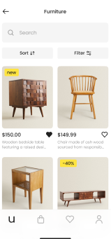
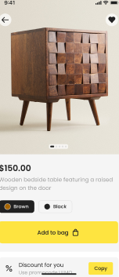
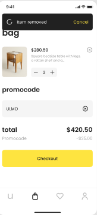
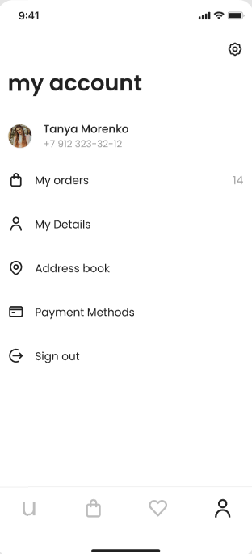
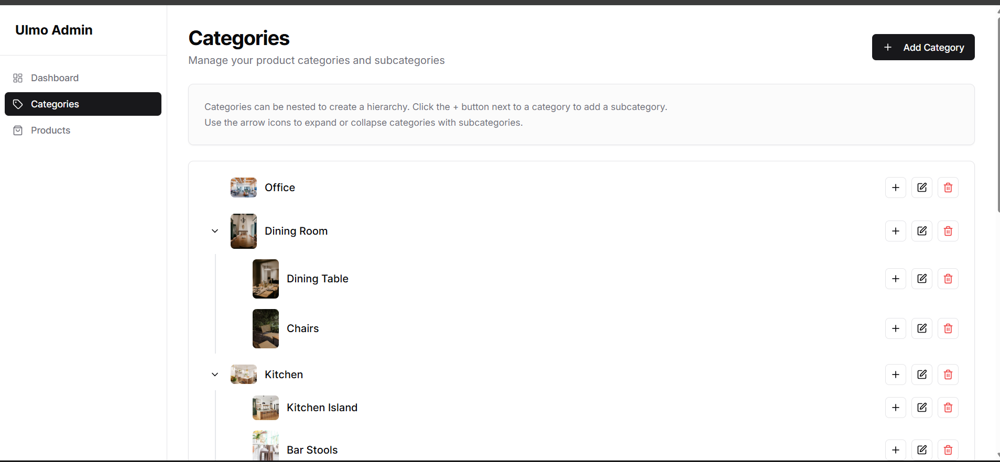
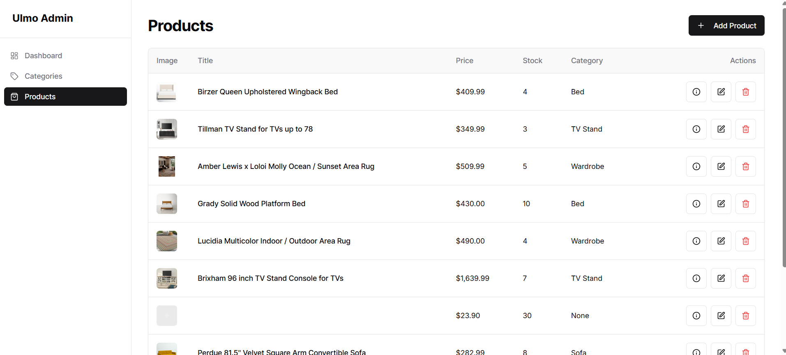

# 🛍️ Ulmo E-Commerce Flutter App

A complete Flutter implementation of the **Ulmo E-Commerce UI Kit**, powered by Firebase and managed via a web-based [Admin Panel](https://v0-firebase-admin-panel-alpha.vercel.app/). This app offers a clean shopping experience inspired by the original Figma design.

---

## 🌟 Features (Inspired by Figma UI)

- 🖼 Modern product **image grid** layout
- 🔍 Product detail view with description, price, and image
- 🛒 Cart functionality with quantity editing
- 🔐 Firebase Authentication (login, register, password reset)
- 📦 Order tracking and history screen
- 🔧 Admin panel for product management
- ☁️ Firebase Firestore & Storage backend

---

## 📱 Screenshots

## 🗂 Category Feature  
Displays a horizontal scrollable list of product categories for filtering.

| Categories |
|------------|
|  |

---

## 🛍 Product Feature  

### 🧱 Product Grid  
Two-column grid displaying product image, name, and price.

| Product Grid |
|--------------|
|  |

### 🔍 Product Details  
Tapping a product opens a detailed view with large image, description, price, and add-to-cart option.

| Product  |
|----------------|
|  |

---

## 🛒 Bag Feature  
View and manage items added to the cart with subtotal calculation.

| Bag (Cart View) |
|-----------------|
|  |

---

## 👤 Profile Feature  
Displays user info, order history, and settings.

| Profile |
|---------|
|  |

---

### ⚙️ Admin Panel (Web)
Add or edit products via the Firebase-powered admin panel.

| Dashboard | Add Product |
|-----------|-------------|
|  |  |
